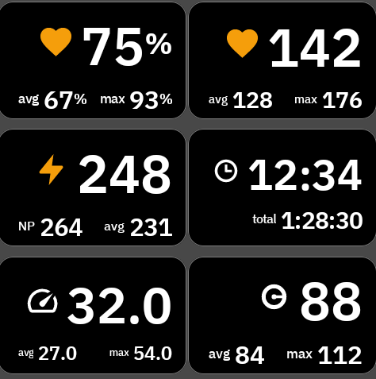

# KStack

[](https://github.com/antmordel/karoo-kstack/actions/workflows/ci.yml)
[](https://github.com/antmordel/karoo-kstack/releases)
[](LICENSE)

**English** · [Español](README.es.md)

Garmin-style stacked data fields for [Hammerhead Karoo](https://www.hammerhead.io/), built on the
official [karoo-ext](https://github.com/hammerheadnav/karoo-ext) SDK.

KStack draws a metric's current value large with its ride aggregates small underneath, so one field
carries three numbers where a stock field carries one.

Compatible with Karoo 2 and Karoo 3.



[Fields](#fields) · [Zone colouring and settings](#zone-colouring-and-settings) ·
[Installation](#installation) · [Updating](#updating) ·
[Building from source](#building-from-source)

## Fields

| Field | Large | Underneath |
|---|---|---|
| HR Stack | Heart rate | avg, max |
| HR% Stack | Heart rate as a percentage of your max HR | avg, max |
| Speed Stack | Speed | avg, max |
| Power Stack | Power | NP, avg |
| Cadence Stack | Cadence | avg, max |
| Time Stack | Lap time | total elapsed, stops included |

All six are graphical fields and scale their text to whatever grid size you place them in.

The aggregates are Karoo's own `AVERAGE_*` and `MAX_*` data types, so they match the stock fields
exactly and follow the same pause and reset behaviour. HR% divides those same heart rate values by
the max HR in your Karoo user profile; if you have set no max HR, those rows stay empty.

Speed follows the unit preference in your Karoo profile, in km/h or mph. Rows resolve
independently, so a disconnected sensor shows `--` on its own row while the others keep updating.

## Zone colouring and settings

Open KStack from the main menu to reach its settings. Each field has its own:

- **Zone colour**: off, the metric icon in the colour of your current zone, or the whole field
  background in it with the text following. Heart rate and power have zones. Speed, cadence and
  time have none, so those fields offer no colour choice.
- **Secondary values**: side by side, or stacked one per row.

Changes apply to fields already on a data page, with no need to re-add them.

## Installation

### [⬇ Download app-release.apk](https://github.com/antmordel/karoo-kstack/releases/latest/download/app-release.apk)

That link always points at the newest release, so it is the one to share or bookmark. The
[release page](https://github.com/antmordel/karoo-kstack/releases/latest) has the notes and
the older versions.

**Karoo 3**: open this page in your phone's browser, long-press the download link above and share
it with the Hammerhead Companion app, then press Install on the Karoo. Hammerhead documents the
flow in [Companion App Sideloading](https://support.hammerhead.io/hc/en-us/articles/31576497036827-Companion-App-Sideloading).

**Karoo 2**: enable sideloading ([DC Rainmaker's guide](https://www.dcrainmaker.com/2021/02/how-to-sideload-android-apps-on-your-hammerhead-karoo-1-karoo-2.html))
and run:

```bash
curl -LO https://github.com/antmordel/karoo-kstack/releases/latest/download/app-release.apk
adb install app-release.apk
```

Open KStack once from the main menu after installing. The six fields then appear in the data field
picker when you edit a data page, listed under the names in the table above.

## Updating

Long-press the KStack icon in the main menu and select Update. The Karoo checks this repository's
latest release and installs it in place, keeping your settings and the fields already on your data
pages.

This works from v0.2.3 onward. A copy sideloaded from an earlier release has no update URL to
follow, so it needs one manual reinstall to pick the mechanism up.

## Building from source

`karoo-ext` is published only to GitHub Packages, which requires authentication even though the
package is public. Create a personal access token with the `read:packages` scope and put it in
`local.properties`:

```properties
gpr.user=your-github-username
gpr.key=ghp_your_token
```

`GPR_USER` and `GPR_KEY` environment variables work too. Then:

```bash
./gradlew assembleDebug
adb install app/build/outputs/apk/debug/app-debug.apk
```

`./gradlew assembleRelease` produces an unsigned APK unless the signing environment variables are
set; see [AGENTS.md](AGENTS.md) for how releases are built and signed.

## Credits

- Built on [karoo-ext](https://github.com/hammerheadnav/karoo-ext) (Apache-2.0)
- Project structure and release conventions follow [timklge/karoo-headwind](https://github.com/timklge/karoo-headwind)

## License

Apache-2.0. See [LICENSE](LICENSE).
